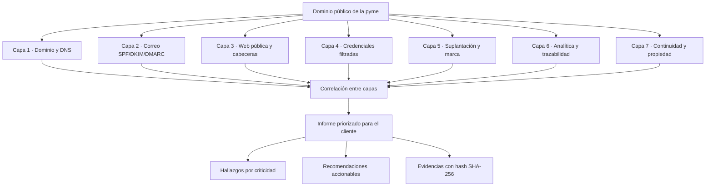

# Auditoría de Exposición Digital para Pymes

> Metodología externa, pasiva y documentada para revisar la huella digital pública de una pyme o autónomo. Siete capas técnicas analizadas como un conjunto, no como piezas sueltas.

Este repositorio recoge la **metodología**, los **checklists**, los **scripts** y un **caso de ejemplo anonimizado** de un servicio de auditoría de exposición digital orientado a pequeñas empresas españolas.

No es un test de intrusión. Todo el análisis se realiza sobre información de acceso público, sin tocar los sistemas del cliente y sin necesidad de credenciales.

---

## Por qué este enfoque

La mayoría de pymes no sabe quién controla realmente su dominio, si su correo puede ser suplantado, si su web filtra información, o si su analítica mide algo. Cada proveedor revisa su parcela —uno la web, otro el correo, otro la analítica— y **nadie mira el conjunto**.

Algunos problemas solo se ven correlacionando capas: un dominio que expira pronto, más un correo sin DMARC, más un perfil falso usando la marca, juntos son una crisis de suplantación esperando a ocurrir. Por separado, pasan desapercibidos.

Esta metodología revisa las siete capas como un sistema y correlaciona los hallazgos.

---

## Las siete capas

| Capa | Qué revisa |
|---|---|
| **1 · Dominio y DNS** | Titularidad, vencimientos, resolución de nombres, DNSSEC |
| **2 · Correo** | Autenticación SPF, DKIM y DMARC |
| **3 · Web pública** | Cabeceras de seguridad, certificado TLS, tecnología expuesta |
| **4 · Credenciales** | Exposición en filtraciones públicas conocidas |
| **5 · Suplantación y marca** | Dominios similares, certificados sospechosos, activos no inventariados |
| **6 · Analítica** | Medición, cookies y consentimiento |
| **7 · Continuidad y propiedad** | Control de activos, servicios huérfanos, puntos de fallo |

---

## Qué entrega una auditoría

- **Informe PDF** con resumen ejecutivo (para el dueño del negocio) y detalle técnico (para su implementador) separados.
- **Hallazgos clasificados** por criticidad: crítico, alto, medio, bajo, informativo.
- **Correlaciones entre capas**: el valor diferencial frente a una revisión por piezas.
- **Plan de remediación priorizado** por impacto y esfuerzo.
- **Cadena de custodia ligera**: cada evidencia con su hash SHA-256 y momento de captura, defendible si el caso escalara a vía legal.
- **Sección "lo que no se ha encontrado"**: lo que está bien, verificado, no solo los problemas.

---

## Estructura del repositorio

| Carpeta | Contenido |
|---|---|
| [`docs/`](docs/) | Metodología, modelo de amenazas y alcance/límites |
| [`checklists/`](checklists/) | Una checklist por cada una de las siete capas |
| [`scripts/`](scripts/) | Comandos y automatizaciones puntuales, comentados |
| [`plantillas/`](plantillas/) | Plantilla de informe y de recogida de datos |
| [`ejemplos/`](ejemplos/) | Caso completo de auditoría sobre un dominio ficticio |
| [`recursos/`](recursos/) | Referencias técnicas y glosario para no-técnicos |

---

## Stack técnico

`whois` · `dig` (BIND 9) · `curl` · `openssl` · [`testssl.sh`](https://testssl.sh) · `dnstwist` · consultas a [Certificate Transparency](https://crt.sh) · `sha256sum` para la integridad de evidencias.

Herramientas estándar de línea de comandos en Linux. Sin dependencias propietarias.

---

## Principios metodológicos

- **Solo OSINT pasivo.** No se accede a sistemas del cliente, no se prueban credenciales, no se explotan vulnerabilidades. Todo es información pública observable.
- **Prueba de control.** Cuando una herramienta devuelve un resultado vacío, se verifica que la herramienta funciona antes de concluir "no hay nada". Distinguir *ausencia confirmada* de *fallo de herramienta*.
- **Trazabilidad.** Cada evidencia se guarda en fichero y se hashea. El informe referencia cada hallazgo a su evidencia.
- **Honestidad sobre los límites.** Lo que no se puede verificar desde fuera se documenta como tal, en lugar de darlo por bueno.

---

## Aviso legal y ético

Esta metodología está pensada para auditar dominios **propios o con autorización**, o para análisis OSINT de información estrictamente pública con fines de aprendizaje y mejora. El reconocimiento activo, el escaneo intrusivo y la explotación de vulnerabilidades quedan fuera de su alcance y pueden ser ilegales sin autorización escrita del titular.

El caso de ejemplo de este repositorio está **anonimizado**: cliente, dominios, identificadores y direcciones han sido sustituidos por valores ficticios.

---

## Estado del proyecto

Este repositorio se construye en abierto, capa a capa, validando cada una con casos reales antes de publicarla.

| Capa | Checklist | Script | Caso ejemplo |
|---|:---:|:---:|:---:|
| 1 · Dominio y DNS | ✅ | ✅ | ✅ |
| 2 · Correo | ✅ | ✅ | ✅ |
| 3 · Web | ✅ | ✅ | ✅ |
| 4 · Credenciales | ✅ | 🟡 | ✅ |
| 5 · Suplantación | ✅ | 🟡 | ✅ |
| 6 · Analítica | ✅ | 🟡 | ✅ |
| 7 · Continuidad | ✅ | 🟡 | ✅ |

✅ completo · 🟡 en progreso · ⬜ planificado

---

## Sobre el autor

**Dragos Andrei** — técnico independiente en ciberseguridad y auditoría digital para pymes y autónomos, con base en Málaga (España). Formación en análisis forense, peritaje informático y filosofía.

Este repositorio es la vitrina técnica de **Control Digital Pymes**: la metodología abierta detrás del servicio.

- 🌐 Web: **[controldigitalpymes.es](https://www.controldigitalpymes.es)**
- 📩 Contacto: forensiq.sentinel@outlook.com
---

## Licencia

[MIT](LICENSE). Úsalo, adáptalo, fórkalo. Si te resulta útil, una mención se agradece.
